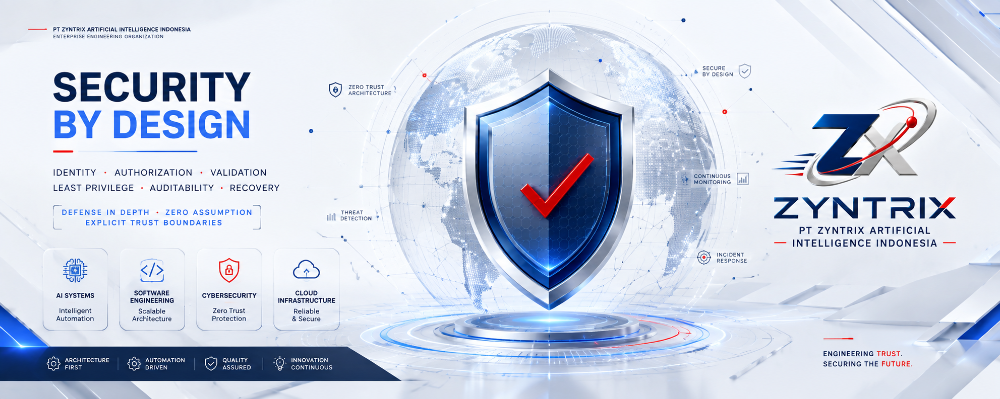

<!--
╔══════════════════════════════════════════════════════════════════════════════╗
║ PT ZYNTRIX ARTIFICIAL INTELLIGENCE — ORGANIZATION PROFILE                 ║
║ Enterprise GitHub Organization README                                      ║
╚══════════════════════════════════════════════════════════════════════════════╝
-->

<p align="center">
  
</p>

<p align="center">
  <a href="https://github.com/PT-ZYNTRIX-ARTIFICIAL-INTELLIGENCE">
    
  </a>
  
  
  
</p>

<p align="center">
  <strong>Engineering secure, scalable, intelligent digital systems for enterprise operations.</strong>
</p>

<p align="center">
  <a href="#-corporate-overview">Overview</a> •
  <a href="#-founder--leadership">Leadership</a> •
  <a href="#-engineering-capabilities">Capabilities</a> •
  <a href="#-mobile--native-architecture">Mobile</a> •
  <a href="#-security-posture">Security</a> •
  <a href="#-flagship-platforms">Flagship Platforms</a> •
  <a href="#-other-projects--engineering-lab">Lab Projects</a>
</p>

<p align="center">
  
</p>

## 🏢 Corporate Overview

**PT Zyntrix Artificial Intelligence** is a premier technology & systems engineering organization. We design, architect, and operate mission-critical digital platforms built on strict software architecture, automated governance, cybersecurity by design, and cloud-native resilience.

> **Engineering Mandate:** Build software as long-term operational infrastructure — clean, maintainable, auditable, and secure by default.

---

## 👨‍💻 Founder & Leadership

<table>
<tr>
<td width="32%" align="center" valign="middle">
  
  <br />
  <sub><strong>Zaki Muhamad Fadilah</strong><br />Founder & Chief Systems Architect</sub>
</td>
<td width="68%" valign="top">

### 👑 Zaki Muhamad Fadilah `(Zack Pratama)`
**Founder & Chief Systems Architect** — PT Zyntrix Artificial Intelligence

- 🎓 **Background:** Informatics Engineering
- ⏳ **Experience:** 3+ Years in Software Engineering, AI Workflows & Web Systems Architecture
- 🎯 **Core Focus:** Building high-performance digital platforms, clean microservices & secure APIs
- 📧 **Direct Contact:** [zaki.muhamad@zackpratama.tech](mailto:zaki.muhamad@zackpratama.tech)

#### 🧰 Technical Stack & Key Technologies
<p>
  
  
  
  
  
  
  
  
  
  
  
  
  
  
  
</p>

> *"Focus, build, deploy, repeat. Build clean, maintainable systems that scale seamlessly without technical debt."*

</td>
</tr>
</table>

---

## 🧩 Engineering Capabilities

| Domain | Engineering Capability | Industry Standard |
|---|---|---|
| 🌐 **Software Engineering** | Next.js, React, Responsive Web & PWA Systems | Clean Architecture, SOLID Principles, Typed Contracts |
| 🧠 **Artificial Intelligence** | Intelligent Workflows, Analytics Automation & Scoring | Traceable Inputs, Model Isolation, Controlled Scope |
| 🛡️ **Cybersecurity** | Zero Trust Architecture, OWASP Alignments & Auth Controls | Defense in Depth, Least Privilege, Server-Side Security |
| ☁️ **Cloud Infrastructure** | Serverless Edge, Docker Containers & CI/CD Pipelines | Automated Quality Gates, Secret Isolation, Immutable Delivery |

---

## 📱 Mobile & Native Architecture

Our mobile engineering methodology enforces **Clean Architecture** across Native and Cross-Platform runtimes.

<table>
<tr>
<td width="33%" valign="top">

### 🤖 Android Native

```text
Kotlin
   ↓
Jetpack Compose
   ↓
Android Jetpack
├── ViewModel
├── Navigation
├── Room
├── WorkManager
├── DataStore
└── CameraX
   ↓
Android SDK
```

</td>
<td width="33%" valign="top">

### 🍎 iOS Native

```text
Swift
   ↓
SwiftUI
   ↓
Clean Architecture
├── Presentation
│   ├── View
│   ├── ViewModel
│   └── Navigation
├── Domain
│   ├── Entity
│   ├── UseCase
│   └── Repository Protocol
├── Data
│   ├── Repository
│   ├── SwiftData
│   └── Cache
└── Platform Services
   ↓
iOS SDK
```

</td>
<td width="34%" valign="top">

### ⚛️ Cross-Platform

```text
TypeScript
   ↓
React Native
   ↓
Expo Router
   ↓
Clean Architecture
├── Presentation (Screens/UI)
├── Domain (UseCases/Entities)
├── Data (SQLite/SecureStore)
├── Native Services (Camera/GPS)
└── Infrastructure (Supabase/EAS)
   ↓
New Architecture (Android + iOS)
```

</td>
</tr>
</table>

#### 🌐 Network Transport Matrix

| Platform / Stack | Network Client | Protocol | State & Storage |
|---|---|---|---|
| **Web (Next.js)** | Fetch API / Axios | REST API / GraphQL / tRPC | React Query / SWR |
| **Android (Kotlin)** | Retrofit / Ktor Client | REST API / gRPC | Flow / Room / DataStore |
| **iOS (Swift)** | URLSession / Alamofire | REST API / GraphQL | SwiftData / Combine |
| **Mobile (React Native)** | Fetch API / Axios / TanStack | REST API / WebSockets | TanStack Query / Expo SQLite |

---

## 🛡️ Security Posture

<p align="center">
  
</p>

```text
UNTRUSTED INPUT ──→ [ VALIDATE ] ──→ [ AUTHORIZE ] ──→ [ EXECUTE LEAST PRIVILEGE ] ──→ [ SECURE RETURN ]
```

- 🔒 **Zero Trust Architecture:** Server-side enforcement, deny-by-default role authorization.
- 🛡️ **OWASP Alignment:** Protection against Injection, XSS, CSRF, IDOR, and Broken Authentication.
- 🔑 **Secret Isolation:** Environment variable isolation with zero hardcoded credentials.

---

## 🌐 Selected Engineering Domains

<p align="center">
  
  
  
  
  
  
  
  
  
  
</p>

---

## 🚀 Flagship Platforms

<table>
<tr>
<td width="50%" valign="top">

### 🏘️ 01. EPS EXPERIENCE
**Resident & Operational Experience Platform**

Enterprise residential experience platform designed for Eight Park Soreang residents, security personnel, engineering teams, and property administrators.

- **Focus:** PropTech · Resident Experience · Security Operations · PWA · Enterprise Architecture
- **Tech Stack:** Next.js · TypeScript · Supabase · PostgreSQL · PWA · Vercel
- **Canonical Status:** Active Core Product *(Consolidates `EPS-EXPERIENCE`, `EIGHT-PARK-SOREANG-EXPERIENCE`, `CLUSTER-EIGHT-PARK-SOREANG`)*

</td>
<td width="50%" valign="top">

### 📊 02. SIMPRO
**Property CRM & Sales Intelligence Platform**

Integrated property sales management platform featuring the **CINTA AI** (Customer Interaction, Nurturing, Tracking & Assistance) ecosystem.

- **Focus:** CRM Architecture · AI Customer Assistant · Lead Management · Sales Automation · Analytics
- **Tech Stack:** Next.js · TypeScript · Supabase · Python · AI/LLM · WhatsApp API
- **Canonical Status:** Active Core Product *(Consolidates `SIMPRO`, `SIMPRO-DMB`, `SIMPRO-DMB-Eight-Park-Soreang`)*

</td>
</tr>
<tr>
<td width="50%" valign="top">

### 🏬 03. MAESTRO ERP
**Enterprise Multi-Entity ERP Platform**

Unified enterprise resource planning platform supporting property development, manufacturing, F&B, and leasing under PT Delapan Maestro Binangkit.

- **Focus:** Enterprise Software · ERP Architecture · Multi-Entity Systems · Business Automation
- **Tech Stack:** TypeScript · Next.js · PostgreSQL · Enterprise Architecture

</td>
<td width="50%" valign="top">

### 🍱 04. SIGAP GIZI
**Digital Distribution Documentation Platform**

Operational field platform supporting documentation workflows for the Makan Bergizi Gratis program at SPPG Bandung Padasuka.

- **Focus:** Government Operations · Field Operations · Digital Documentation · Offline-First PWA
- **Tech Stack:** Next.js · TypeScript · Supabase · PostgreSQL · Google Drive API · PWA
- **Canonical Status:** Active Core Product *(Consolidates `SIGAP-GIZI` & Native field implementation)*

</td>
</tr>
<tr>
<td width="50%" valign="top">

### 🔍 05. CipherOps Intelligence
**OSINT Investigation & Digital Fraud Intelligence**

Independent investigation platform focused on digital fraud intelligence, OSINT workflows, evidence organization, and intelligence reporting.

- **Focus:** OSINT · Digital Fraud Investigation · Evidence Management · Cybersecurity Research
- **Tech Stack:** Python · OSINT Automation · Data Analysis

</td>
<td width="50%" valign="top">

### 🤖 06. CEKAS.AI
**Artificial Intelligence Platform**

AI-focused software project exploring intelligent automation, application-level LLM integration, and scalable AI-assisted workflows.

- **Focus:** Artificial Intelligence · LLM Integration · Automation · AI Application Engineering
- **Tech Stack:** TypeScript · AI/LLM · Web Application

</td>
</tr>
</table>

---

## 🧪 Other Projects & Engineering Lab

| Project Name | Domain & Scope | Core Technologies | Canonical Note |
|---|---|---|---|
| **Payment Operations Infrastructure** | Payment operations, transaction processing & backend reliability | Backend Engineering, Transaction Ops, Reliability | Infrastructure Engine |
| **E-MAESTRO PAY** | Digital payment application in the Maestro technology ecosystem | FinTech, Digital Payment, Web Engineering | HTML / Web Tech |
| **EIGHT PARK WALLET** | Digital wallet concept supporting ecosystem transactions | FinTech, PropTech, Digital Wallet | Consolidates `EIGHT-PARK-WALLET` variants |
| **DUNIA ESPORTS** | Esports tournament management & event competition platform | Esports Tech, Event Operations, Web Platform | TypeScript Web App |
| **MAESTRO MILK** | Internal business digitalization & operational technology | Business Digitalization, Internal Systems | Operational Tech |
| **RED SHADOW CYBER FORCE IDN** | Security research, penetration testing & defensive analysis | Cybersecurity, PenTesting, Defensive Systems | Security Research Lab |

---

## 📡 Organization Links & Direct Contact

<p align="center">
  <a href="https://github.com/PT-ZYNTRIX-ARTIFICIAL-INTELLIGENCE">
    
  </a>
  <a href="mailto:zaki.muhamad@zackpratama.tech">
    
  </a>
  <a href="https://github.com/PT-ZYNTRIX-ARTIFICIAL-INTELLIGENCE?tab=repositories">
    
  </a>
</p>

---

<p align="center">
  
</p>

<p align="center">
  <sub>
    © PT Zyntrix Artificial Intelligence · Enterprise Engineering Organization
    <br />
    Secure by Design · Architecture First · Automation Driven
  </sub>
</p>
