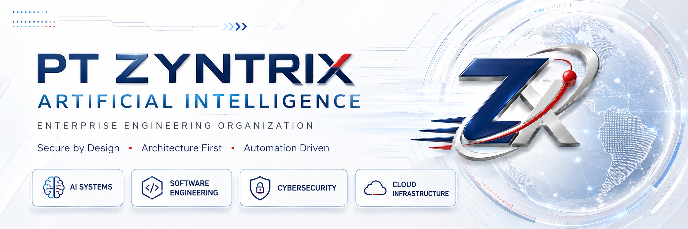
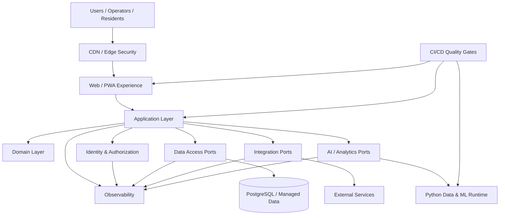
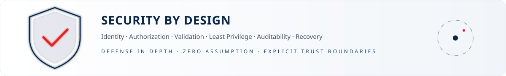
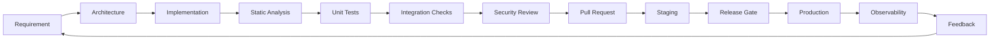
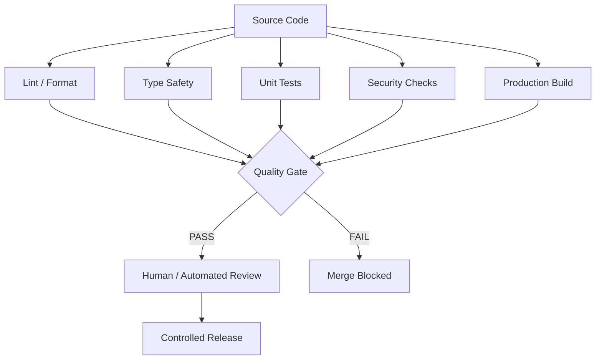
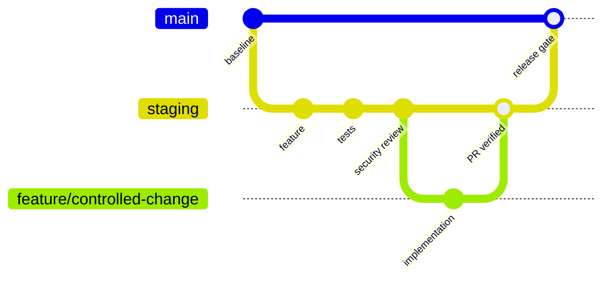
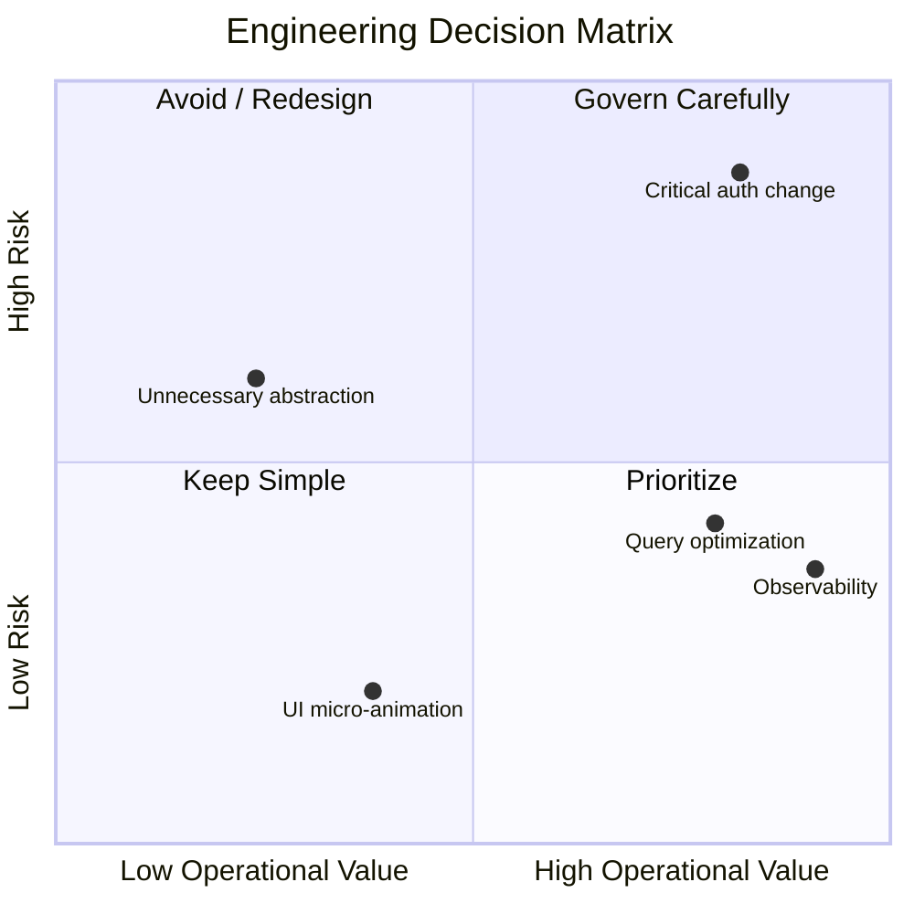
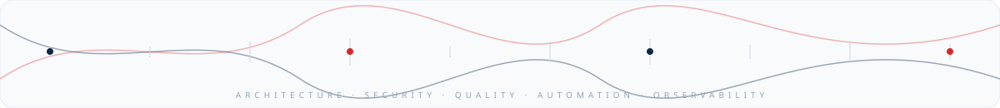
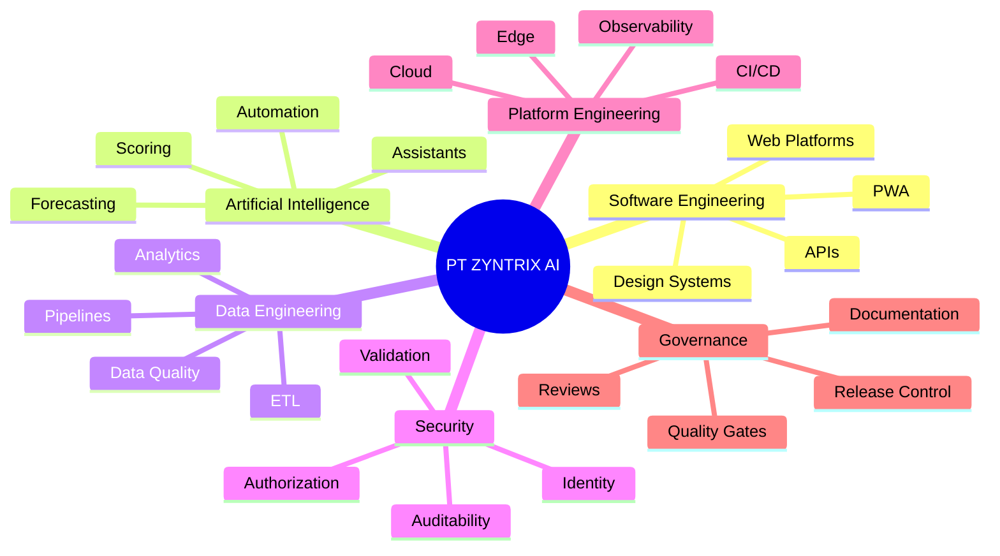
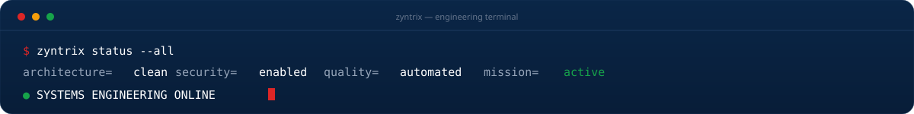

<!--
╔══════════════════════════════════════════════════════════════════════════════╗
║ PT ZYNTRIX ARTIFICIAL INTELLIGENCE — ORGANIZATION PROFILE                 ║
║ Enterprise GitHub Organization README                                      ║
║ Repository: PT-ZYNTRIX-ARTIFICIAL-INTELLIGENCE/.github                    ║
║ Path: profile/README.md                                                     ║
╚══════════════════════════════════════════════════════════════════════════════╝
-->

<p align="center">
  
</p>

<p align="center">
  <a href="https://github.com/PT-ZYNTRIX-ARTIFICIAL-INTELLIGENCE">
    
  </a>
  
  
  
</p>

<p align="center">
  <strong>Engineering secure, scalable, intelligent digital systems for real-world operations.</strong>
</p>

<p align="center">
  Artificial Intelligence · Software Engineering · Data Engineering · Cloud Infrastructure · Cybersecurity · Digital Operations
</p>

<p align="center">
  <a href="#-corporate-overview">Corporate Overview</a> •
  <a href="#-founder--technical-leadership">Founder</a> •
  <a href="#-engineering-capabilities">Capabilities</a> •
  <a href="#-technology-platform">Technology</a> •
  <a href="#-architecture-principles">Architecture</a> •
  <a href="#-native--cross-platform-mobile-engineering">Mobile</a> •
  <a href="#-security-posture">Security</a> •
  <a href="#-platform-portfolio">Portfolio</a> •
  <a href="#-engineering-governance">Governance</a>
</p>

<p align="center">
  
</p>

## 🏢 Corporate Overview

**PT Zyntrix Artificial Intelligence** is an engineering organization focused on designing and operating modern digital platforms with a strong foundation in software architecture, intelligent automation, data systems, security, and cloud-native delivery.

We approach software as **operational infrastructure** — not merely application code. Every platform is designed around maintainability, observability, security boundaries, controlled change, measurable quality, and long-term scalability.

> **Engineering mandate:** Build systems that remain understandable under growth, auditable under pressure, secure by default, and maintainable by teams beyond their original authors.

<table>
<tr>
<td width="33%" valign="top">

### ⚙️ Engineering
- Full-stack platforms
- API & service design
- Modular frontend systems
- PWA / mobile-first delivery
- Integration engineering

</td>
<td width="33%" valign="top">

### 🧠 Intelligence
- AI-assisted workflows
- Data pipelines & ETL
- Lead / event scoring
- Forecasting
- Analytics automation

</td>
<td width="33%" valign="top">

### 🛡️ Assurance
- Security by Design
- OWASP-aligned controls
- Least privilege
- Auditability
- CI/CD quality gates

</td>
</tr>
</table>

---

## 👨‍💻 Founder & Technical Leadership

<table>
<tr>
<td width="36%" align="center" valign="middle">
  
  <br />
  <sub><strong>Zaki Muhamad Fadilah</strong><br />Founder & Technical Lead</sub>
</td>
<td width="64%" valign="top">

### 👑 Zaki Muhamad Fadilah `(Zack Pratama)`
**Founder & Chief Systems Architect** — PT Zyntrix Artificial Intelligence

- 🎓 **Background:** Informatics Engineering
- ⏳ **Experience:** 3+ Years in Software Engineering, AI Workflows & Web Systems Architecture
- 🎯 **Core Focus:** Building high-performance digital platforms, clean microservices & secure APIs

#### 🧰 Technical Stack & Key Technologies
<p>
  
  
  
  
  
  
  
  
  
  
  
  
  
  
  
</p>

> *"Focus, build, deploy, repeat. Build clean, maintainable systems that scale seamlessly without technical debt."*

</td>
</tr>
</table>

---

## 🎯 Engineering Mission

```text
DESIGN FOR CHANGE
      ↓
BUILD FOR SCALE
      ↓
SECURE BY DEFAULT
      ↓
OBSERVE EVERYTHING
      ↓
AUTOMATE QUALITY
      ↓
OPERATE WITH CONFIDENCE
```

Our engineering direction prioritizes:

- **Architecture before accumulation** — avoid god files, hidden coupling, and accidental complexity.
- **Security as a system property** — not a final checklist.
- **Automation over tribal knowledge** — quality gates must be reproducible.
- **Explicit boundaries** — domain, application, infrastructure, and UI concerns remain decoupled.
- **Operational visibility** — failures must be diagnosable, attributable, and recoverable.
- **Measured scalability** — optimize where evidence supports it; avoid premature complexity.

<p align="center">
  
</p>

## 🧩 Engineering Capabilities

| Domain | Capability | Engineering Standard |
|---|---|---|
| **Frontend Engineering** | Responsive web, PWA, design systems, interactive operational UI | Component isolation, accessibility, performance budgets, typed contracts |
| **Backend Engineering** | APIs, authorization, workflow services, database access | Clean boundaries, validation, idempotency, structured errors |
| **Data Engineering** | ETL, ingestion, normalization, analytics pipelines | Deterministic jobs, schema contracts, retries, observability |
| **Artificial Intelligence** | Intelligent assistants, scoring, forecasting, workflow augmentation | Human-controlled scope, model isolation, traceable inputs/outputs |
| **Cloud Engineering** | Deployment, edge, CDN, storage, managed infrastructure | Immutable delivery, least privilege, secret isolation |
| **Security Engineering** | Threat mitigation, secure coding, access control, audit design | OWASP alignment, defense in depth, secure defaults |
| **DevOps / Platform** | CI/CD, quality gates, release discipline | Automated verification, branch governance, rollback readiness |

---

## 🧱 Architecture Principles



### Architectural rules

```text
UI  ───────→ Application ───────→ Domain
                 │
                 ├──────────────→ Ports
                 │                   │
                 │                   ├── Data
                 │                   ├── Identity
                 │                   ├── Integration
                 │                   └── Intelligence
                 │
Infrastructure ──┴──── implements contracts, never owns business rules
```

**Non-negotiable principles**

- **SOLID** and clear module ownership.
- **Dependency inversion** for infrastructure-facing concerns.
- **Single responsibility** at file, module, and service level.
- **Schema validation at trust boundaries**.
- **Parameterized database operations**; no raw untrusted interpolation.
- **No N+1 query patterns** in critical data paths.
- **Explicit caching strategy** where repeated reads justify it.
- **Idempotency** for retryable side effects and webhook-like workflows.
- **Structured logging** with correlation identifiers.
- **Testability by construction**, not by afterthought.

---

## 📱 Native & Cross-Platform Mobile Engineering

Our mobile engineering methodology enforces **Clean Architecture**, modular layer separation, and strict protocol boundaries across Android, iOS, and Cross-Platform runtimes.

<table>
<tr>
<td width="33%" valign="top">

### 🤖 Android Native Stack

```text
Kotlin
   ↓
Jetpack Compose
   ↓
Android Jetpack
├── ViewModel
├── Navigation
├── Room
├── WorkManager
├── DataStore
└── CameraX
   ↓
Android SDK
```

</td>
<td width="33%" valign="top">

### 🍎 iOS Native Stack

```text
Swift
   ↓
SwiftUI
   ↓
Clean Architecture
├── Presentation
│   ├── View
│   ├── ViewModel
│   └── Navigation
│
├── Domain
│   ├── Entity
│   ├── UseCase
│   └── Repository Protocol
│
├── Data
│   ├── Repository
│   ├── API Client
│   ├── SwiftData
│   └── Cache
│
└── Platform
    ├── AVFoundation
    ├── CoreLocation
    ├── UserNotifications
    ├── LocalAuthentication
    └── BackgroundTasks
   ↓
iOS SDK
```

</td>
<td width="34%" valign="top">

### ⚛️ Cross-Platform Stack

```text
TypeScript
   ↓
React Native
   ↓
Expo
   ↓
Clean Architecture
├── Presentation
│   ├── Screens
│   ├── Components
│   ├── Expo Router
│   └── State Management
│
├── Domain
│   ├── Entities
│   ├── Use Cases
│   └── Repository Interfaces
│
├── Data
│   ├── API Client
│   ├── Repository Implementation
│   ├── Expo SQLite
│   └── SecureStore
│
├── Native Services
│   ├── Camera
│   ├── Location
│   ├── Notifications
│   ├── Biometrics
│   └── File System
│
└── Infrastructure
    ├── Supabase
    ├── Sentry
    └── EAS
   ↓
React Native New Architecture
   ↓
Android SDK + iOS SDK
```

</td>
</tr>
</table>

### 🌐 Client & API Communication Network Matrix

| Platform / Runtime | Primary Network Client | Data Transport Protocol | State & Cache Management |
|---|---|---|---|
| **Next.js Web** | Fetch API / Axios | REST API / GraphQL / tRPC | React Query / SWR |
| **Kotlin + Jetpack Compose** | Retrofit / Ktor Client | REST API / gRPC | Flow / Coroutines / Room |
| **Swift + SwiftUI** | URLSession / Alamofire | REST API / GraphQL | SwiftData / Combine / AsyncSequence |
| **React Native + Expo** | Fetch API / Axios / TanStack Query | REST API / GraphQL / WebSockets | TanStack Query / Expo SQLite / SecureStore |

```text
┌───────────────────────────┐    ┌──────────────────────────────────┐
│   Next.js (Web / PWA)     │───→│  REST API / GraphQL / tRPC       │
├───────────────────────────┤    ├──────────────────────────────────┤
│   Android (Kotlin Compose)│───→│  Retrofit / Ktor Client          │
├───────────────────────────┤    ├──────────────────────────────────┤
│   iOS (Swift + SwiftUI)   │───→│  URLSession / Alamofire          │
├───────────────────────────┤    ├──────────────────────────────────┤
│   Cross-Platform (Expo)   │───→│  Fetch API / Axios / TanStack    │
└───────────────────────────┘    └──────────────────────────────────┘
```

---

## 🧰 Technology Platform

<p align="center">
  
</p>

### Primary engineering stack

```yaml
frontend:
  language: TypeScript
  framework: Next.js
  ui:
    - React
    - Tailwind CSS
    - shadcn/ui
    - Framer Motion
  delivery:
    - Responsive Web
    - PWA
    - TWA where applicable

backend:
  runtime:
    - Node.js
    - Managed serverless / edge workloads
  data:
    - PostgreSQL
    - Supabase
  contracts:
    - Typed request/response models
    - Runtime schema validation

data_and_intelligence:
  runtime: Python
  workloads:
    - ETL
    - Analytics
    - Forecasting
    - Scoring
    - Document processing
    - AI-assisted automation

platform:
  source_control: GitHub
  deployment:
    - Vercel
    - Cloudflare
  containers:
    - Docker
  quality:
    - CI/CD
    - Automated checks
    - Review gates
```

---

## 🛡️ Security Posture

<p align="center">
  
</p>

Security controls are designed around **defense in depth** and **least privilege**.

| Control Plane | Baseline |
|---|---|
| **Identity** | Strong authentication, role boundaries, session security |
| **Authorization** | Deny-by-default, least privilege, server-side enforcement |
| **Input** | Runtime validation, normalization, length/type constraints |
| **Database** | Parameterized queries, RLS where applicable, constrained privileges |
| **Secrets** | Environment isolation, no secrets committed to source control |
| **Transport** | TLS, secure headers, protected cookies where applicable |
| **Application** | OWASP Top 10-aware implementation and review |
| **API** | Authentication, authorization, validation, rate/abuse controls |
| **Dependencies** | Controlled upgrades, vulnerability awareness, lockfiles |
| **CI/CD** | Protected release path, automated checks, review gates |
| **Logging** | Structured events without leaking sensitive data |
| **Recovery** | Backup awareness, rollback strategy, incident-ready diagnostics |

### Secure engineering invariant

```text
UNTRUSTED INPUT
      │
      ▼
[ VALIDATE ]
      │
      ▼
[ AUTHORIZE ]
      │
      ▼
[ EXECUTE WITH LEAST PRIVILEGE ]
      │
      ▼
[ LOG SAFELY ]
      │
      ▼
[ RETURN MINIMAL DATA ]
```

> Security controls must exist on the **trusted server boundary**. Client-side restrictions are treated only as UX deterrence and never as authorization controls.

---

## 🚀 Platform Portfolio

### 🏘️ EPS EXPERIENCE

**Operational platform for the Eight Park Soreang residential ecosystem.**

```text
Resident Experience
       │
       ├── Service Operations
       ├── Security Workflows
       ├── Guest / Access Processes
       ├── Emergency & Incident Flows
       ├── Billing / Operational Utilities
       └── Staff Operations
```

**Engineering direction:** mobile-first, PWA-oriented, modular operational workflows, strict role boundaries, high-quality resident experience, and maintainable service architecture.

<p>
  <a href="https://github.com/PT-ZYNTRIX-ARTIFICIAL-INTELLIGENCE/EPS-EXPERIENCE">
    
  </a>
</p>

### 🍱 SIGAP GIZI

**Digital operational platform supporting structured field documentation workflows.**

```text
Field Operation
      │
      ├── Distribution Evidence
      ├── Beneficiary Master Data
      ├── Team-aware Workflows
      ├── Photo / Documentation Flow
      ├── Offline-aware Operations
      └── Controlled Storage Integration
```

**Engineering direction:** low-cost managed infrastructure, field reliability, data isolation, controlled uploads, reproducible operational evidence, and mobile-first execution.

<p>
  <a href="https://github.com/PT-ZYNTRIX-ARTIFICIAL-INTELLIGENCE/SIGAP-GIZI">
    
  </a>
</p>

---

## 🔁 Software Delivery Lifecycle



### Definition of Done

A change is **not considered done** merely because it runs locally.

```text
[✓] Requirement understood
[✓] Ownership / module boundary clear
[✓] Runtime validation implemented
[✓] Authorization verified
[✓] Error handling implemented
[✓] Logs are useful and safe
[✓] Tests cover critical behavior
[✓] Static checks pass
[✓] No accidental secret exposure
[✓] Documentation updated when architecture changes
[✓] Review complete
[✓] Release path reproducible
```

---

## 🧪 Quality Engineering



### Quality targets

- No knowingly broken build merged to protected release branches.
- No credentials, private keys, or production secrets in repositories.
- No monolithic "god modules" without explicit architectural justification.
- No silent error swallowing in critical workflows.
- No security decision delegated exclusively to the browser/client.
- No production-side effect without an understood failure/retry model.
- No database hot path accepted without query-shape awareness.

---

## 🌐 Reliability & Observability

```text
REQUEST
   │
   ├── correlation_id
   ├── actor / role context
   ├── route / operation
   ├── duration
   ├── outcome
   └── error class (when applicable)
          │
          ▼
   STRUCTURED TELEMETRY
          │
          ├── diagnostics
          ├── operational metrics
          ├── incident analysis
          └── capacity decisions
```

We optimize for **diagnosable failure** over mysterious failure.

Operational systems should make it possible to answer:

- What failed?
- Where did it fail?
- For which operation?
- Was the failure retried?
- Was data partially written?
- Which dependency was involved?
- Is the failure isolated or systemic?
- Can the action be safely replayed?

---

## 📐 Engineering Governance

### Repository expectations

```text
repository/
├── docs/                  # architecture, ADRs, security, operational notes
├── src/
│   ├── app/               # delivery / framework layer
│   ├── features/          # vertical feature modules
│   ├── domain/            # business rules where applicable
│   ├── infrastructure/    # adapters and implementation details
│   └── shared/            # intentionally shared primitives
├── tests/                 # automated verification
├── .github/               # workflows, templates, governance
└── README.md              # repository contract and operating context
```

### Change governance



> Branch names shown above represent a governance pattern. Individual repositories may implement stricter rules according to their operational risk.

---

## 📚 Documentation Standard

Architecture and operational decisions should be documented close to the codebase.

Recommended documentation set:

| Document | Purpose |
|---|---|
| `README.md` | Repository contract, setup, ownership, architecture summary |
| `ARCHITECTURE.md` | System boundaries, data flow, runtime topology |
| `SECURITY.md` | Security policy, reporting, implementation requirements |
| `CONTRIBUTING.md` | Contribution and review expectations |
| `ENVIRONMENT.md` | Environment variables without secret values |
| `DEPLOYMENT.md` | Release topology, prerequisites, rollback notes |
| `TESTING.md` | Test strategy and quality gates |
| `ADR/` | Architecture Decision Records |
| `RUNBOOK.md` | Operational diagnostics and recovery procedures |

---

## 🤝 Contribution Model

Engineering contributions should be:

1. **Scoped** — one clear responsibility per change.
2. **Reviewable** — avoid unrelated refactors mixed into feature delivery.
3. **Tested** — critical behavior must have deterministic verification.
4. **Documented** — architecture-impacting changes update documentation.
5. **Secure** — trust boundaries and permissions are explicitly reviewed.
6. **Recoverable** — deployment and migration risk must be understood.

---

## 🔐 Responsible Security Disclosure

If you identify a potential security issue in a Zyntrix-managed repository:

**Do not publish exploit details in a public issue.**

Use the repository's private security reporting mechanism when available, or contact the organization through an approved private channel.

A useful report should include:

```text
- Affected repository / component
- Vulnerability class
- Reproduction prerequisites
- Minimal reproduction steps
- Expected impact
- Suggested mitigation, if known
- Evidence without exposing unrelated sensitive data
```

---

## 🧭 Engineering Decision Framework



---

## 🧬 Organization DNA

<p align="center">
  
</p>

```text
ZYNTRIX
│
├── THINK IN SYSTEMS
├── DESIGN EXPLICIT BOUNDARIES
├── AUTOMATE REPETITIVE ASSURANCE
├── SECURE EVERY TRUST TRANSITION
├── MEASURE BEFORE OPTIMIZING
├── DOCUMENT IMPORTANT DECISIONS
├── KEEP FAILURE RECOVERABLE
└── LEAVE THE CODEBASE BETTER THAN YOU FOUND IT
```

---

## 🗺️ Strategic Engineering Map



---

## 🛰️ Current Engineering Focus

<table>
<tr>
<td width="50%" valign="top">

### Product Engineering
- Operational platforms
- Resident / customer experience
- Field workflows
- Secure internal systems
- PWA-first delivery

</td>
<td width="50%" valign="top">

### Intelligence Engineering
- Data ingestion
- Workflow automation
- Analytics
- Forecasting
- AI-assisted interaction

</td>
</tr>
</table>

---

## 📡 Organization Links

<p align="center">
  <a href="https://github.com/PT-ZYNTRIX-ARTIFICIAL-INTELLIGENCE">
    
  </a>
  <a href="https://github.com/PT-ZYNTRIX-ARTIFICIAL-INTELLIGENCE?tab=repositories">
    
  </a>
</p>

---

<p align="center">
  
</p>

<p align="center">
  <sub>
    © PT Zyntrix Artificial Intelligence · Engineering Organization Profile
    <br />
    Secure by Design · Architecture First · Automation Driven
  </sub>
</p>
